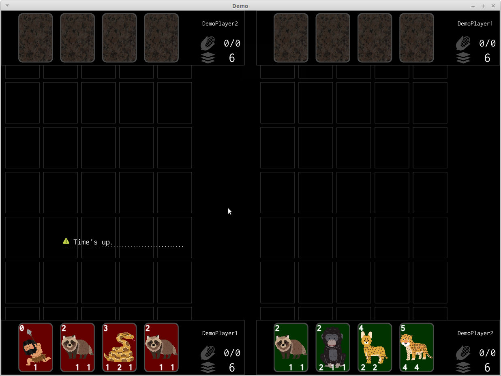

# このGameについて  關於這遊戲  About this game

8sensesのCardGameであるBattleLineConquestを元にしたCardGame  
A card-game inspired by "Battle Line Conquest" which is a card-game developed by 8senses  
[Battle Line Conquest Download Site](http://www.melonbooks.com/index.php?main_page=product_info&products_id=IT0000133702)

現在開發中 Still in development

# 開發環境

Python 3.5.0  
Kivy 1.10  

# 開發記録(Developer's Dialy)

[\#3 戦闘Animationと効果音とBGMを入れた](https://youtu.be/FIx4GSbXfH8)  
[\#2 戦闘の内部処理を実装](https://www.youtube.com/watch?v=IpezHoQzFj4)  
[\#1 Cardの詳細を見る機能を実装](https://www.youtube.com/watch?v=hSiaKXm4d74)  
